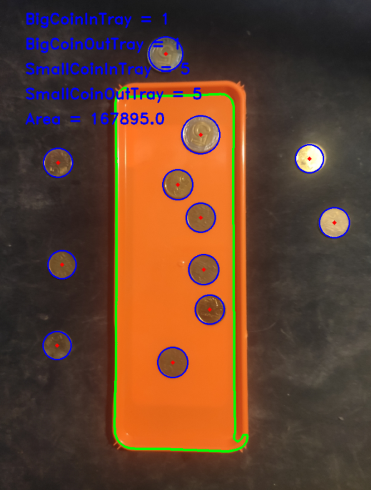

# Coin Detection Project

This project uses OpenCV to detect and count coins in an image of a tray, distinguishing between coins inside and outside the tray.

## Table of Contents

- [Introduction](#introduction)
- [Requirements](#requirements)
- [Usage](#usage)
- [Results](#results)
- [File Description](#file-description)
- [Notes](#notes)

## Introduction

This project detects and counts coins in an image using OpenCV. The process involves:
- Reading the image and applying blur to reduce noise.
- Converting the image to grayscale.
- Applying a binary threshold to get a binary image.
- Finding contours to detect the tray.
- Using Hough Transform to detect circles (coins) in the image.
- Classifying coins based on their size and location (inside or outside the tray).
- Annotating the image with the count of each type of coin.

## Requirements

- Python 3.x
- OpenCV (`cv2`)
- NumPy (`numpy`)

You can install the required packages using the following command:
```bash
pip install opencv-python-headless numpy
```

## Usage

To run the script, use:
```bash
python coin_detection.py
```

## Results

### Image Processing Result
After running the script, the output image with the detected tray and coins annotated will be displayed.



## File Description

coin_counter.py: This script contains the main logic for image processing, coin detection, classification, and counting.
## Notes

This is a basic implementation and can be extended to include features like:

Support for different coin shapes (not just circular).
Improved noise reduction techniques.
Classification of more than two coin types.

